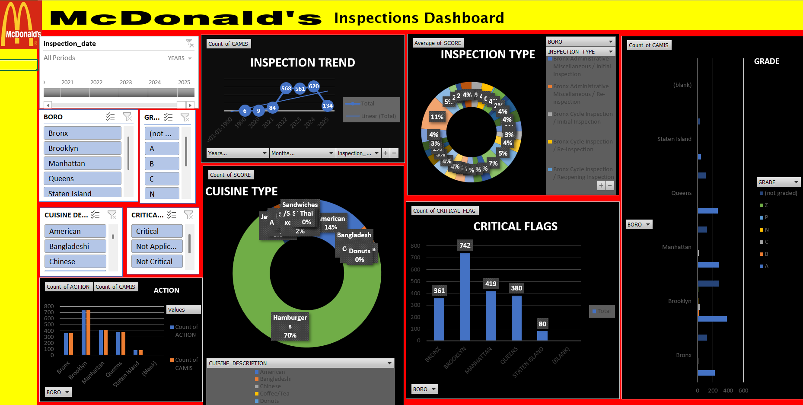
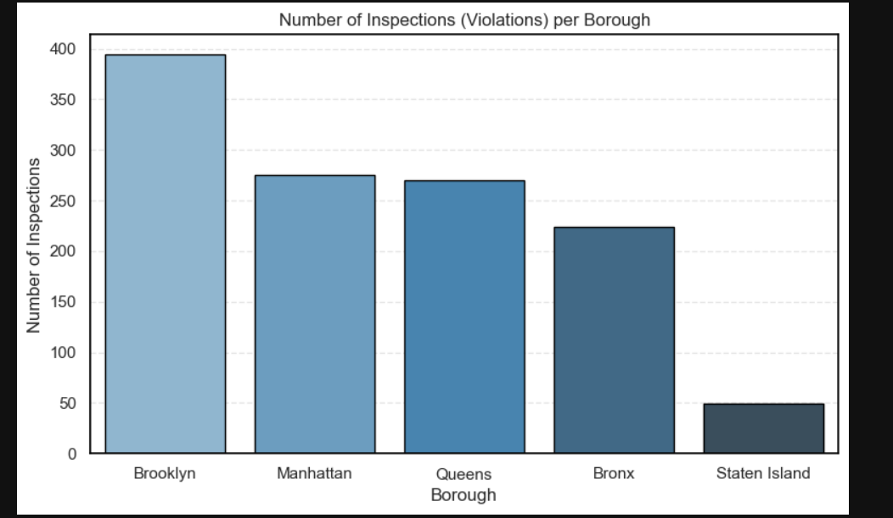
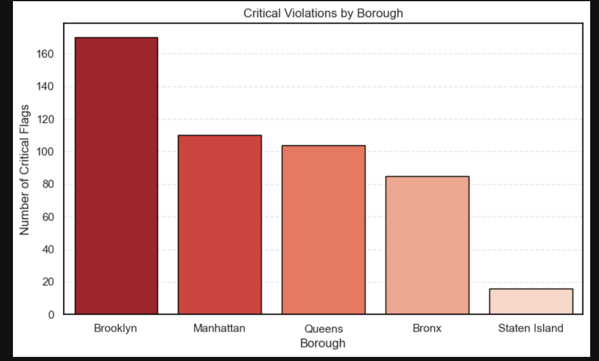

# McDonald's Inspection Data & Analysis 

### Project Overview

This repository contains a comprehensive analysis of New York City's health inspection data for McDonald's restaurants. The project leverages **Python** for initial data cleaning, transformation, and exploratory analysis, and culminates in a fully interactive **Microsoft Excel dashboard** designed for user-friendly data exploration.

The primary goal is to uncover patterns in inspection results, identify the most common violations, and compare performance across different NYC boroughs.

---

### 📊 Interactive Excel Dashboard

The heart of this project is the interactive dashboard, which allows for a dynamic exploration of the inspection data.

* **To use:** Simply download the `McDonalds_NYC_Inspection_Analysis.xlsx` file and open it in Excel.

#### Key Dashboard Features:
* **Performance by Borough:** Interactively filter the data to view scores, grades, and violation counts for each borough.
* **Violation Analysis:** Drill down into the specific types of critical and non-critical violations.
* **Grade Distribution:** See the percentage of restaurants that received 'A', 'B', or 'C' grades over time.

---

###  Python Analysis & Visual Insights

Before building the dashboard, a thorough exploratory data analysis was conducted in the `McDonalds_Inspection_Analysis.ipynb` Jupyter Notebook. This phase was critical for understanding the data's structure, identifying key trends, and deciding which metrics to feature in the dashboard.

Below are the key visual insights generated during the Python analysis.

#### 1. Inspection Distribution by Borough
This chart confirms that inspection volume is heavily concentrated in **Brooklyn** and **Manhattan**, which is expected given the high density of establishments in these areas.

#### 2. Critical Violations by Borough
While inspections are high in Manhattan, this plot reveals that **Brooklyn** records the highest absolute number of critical health code violations.

---

###  Repository Files

* `McDonalds_NYC_Inspection_Analysis.xlsx`: The final interactive Excel dashboard.ning and exploratory visualization.
* `report12315696.pdf`: A detailed project report that outlines the methodology, findings, and conclusions.
* `McDonald_s_20250410.csv`: The raw, unprocessed dataset used for this analysis.
